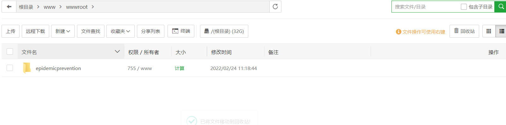
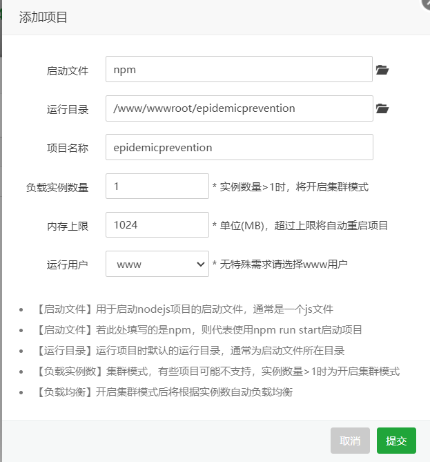
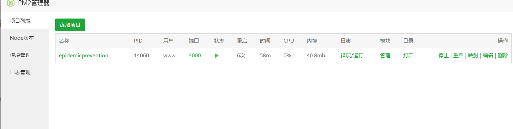

1. 宝塔面板配置redis服务 添加数据库 mydb 用户名 mydb 密码 admin 导入数据 并用workbench远程连接看数据是否导入成功

2. epidemicprevention_api文件model/model.js修改数据库配置 host设置为服务器ip地址

3. epidemicprevention_page文件将所有接口url设置为`http://公网地址.3000` 3000是项目后端接口

   并将epidemicprevention-_page的启动端口和后端一个端口 即公用一个端口

4. epidemicprevention_page执行`npm run build`

5. 将生成的dist文件复制到epidemicprevention_api文件下  

   app.js中添加配置:

   ```javascript
   app.use(logger('dev'));
   app.use(express.json());
   app.use(express.urlencoded({ extended: false }));
   app.use(cookieParser());
   app.use(express.static(path.join(__dirname, 'public')));
   // ----------------下面这三行是我们新添加的-----------
   var history = require('connect-history-api-fallback');
   app.use(express.static(path.join(__dirname, 'dist')));
   app.use(history());
   ```

6. 将epidemicprevention_api压缩上传到宝塔面板下的wwwroot目录下

   

7. pm2设置启动

   

   

8. 端口若是没有检测出来 手动设置3000 

9. 这时候已经可以通过htttp://服务器ip:3000/进行访问

10. 自行绑定域名  域名根目录为wwwroot/epidemicprevention

11. 浏览器:域名:3000进行访问